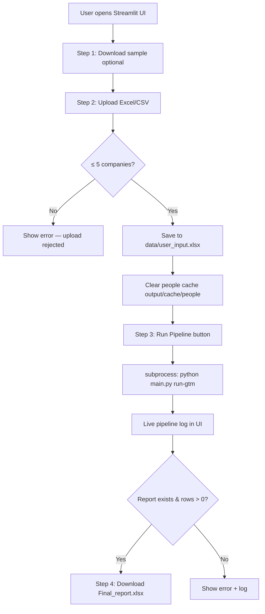
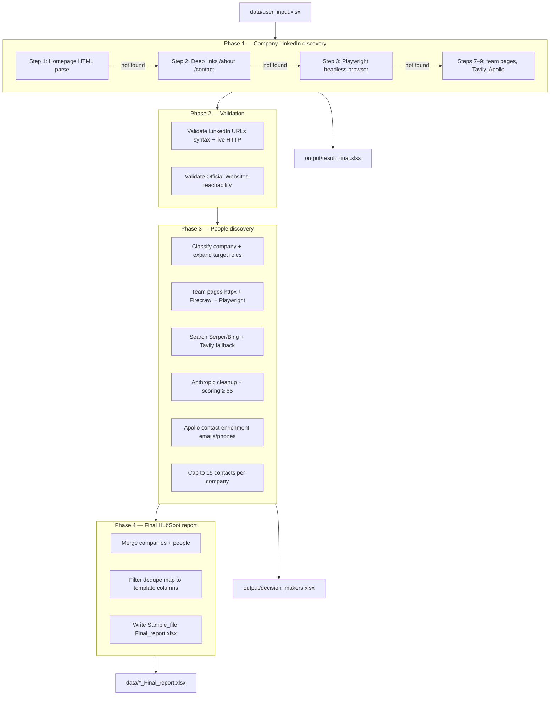
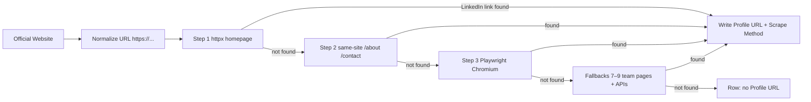
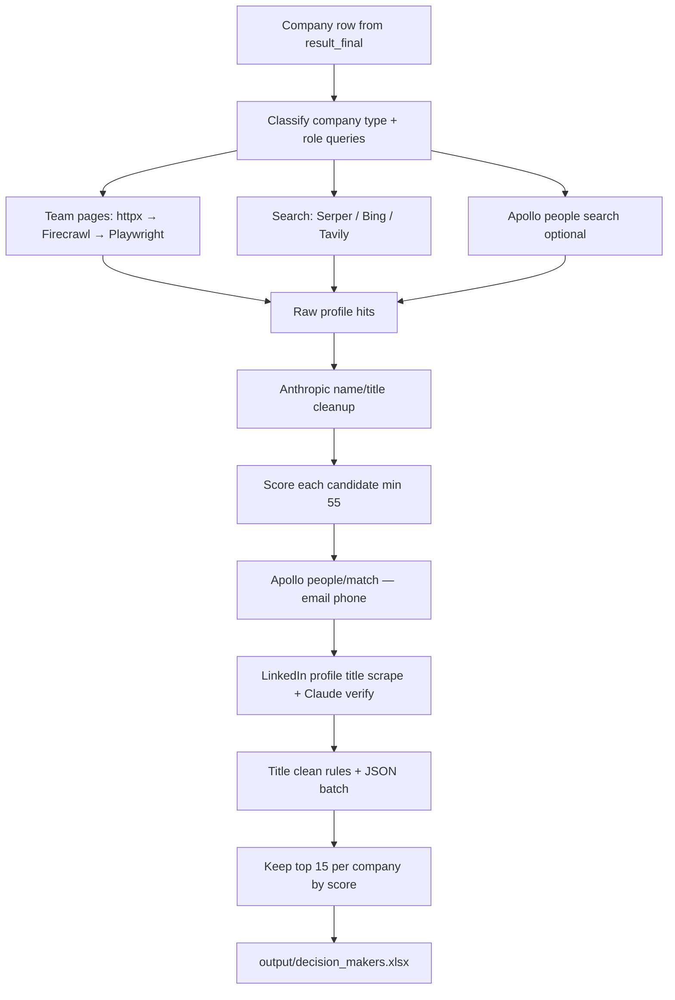
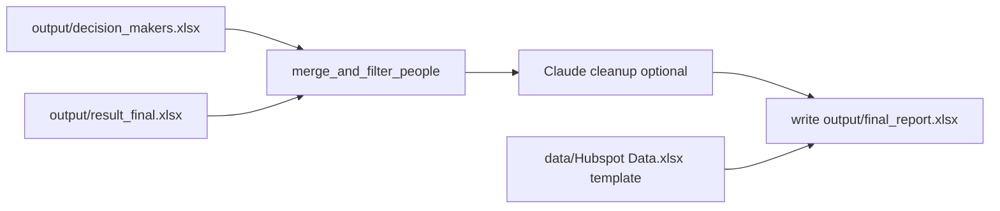

# GTM Full Pipeline Flow

End-to-end explanation of what happens when you upload a company Excel file (for example `Sample_file (1).xlsx`) through the **Streamlit UI** or the **`run-gtm` CLI**.

---

## Example input file

**File:** `C:\Users\LENOVO\Downloads\Sample_file (1).xlsx`  
**Format:** `.xlsx` or `.csv` (UTF-8)  
**Required column:** `Official Website`  
**Typical columns:** `Company Name`, `Official Website`, and optional firmographics (AUM, Country, etc.)

**Upload limit (Streamlit):** max **5 companies** per run.

### Example rows (5 companies)

| Company Name | Official Website |
|--------------|------------------|
| Invesco Real Estate | invesco.com |
| Cohen & Steers Capital Management | cohenandsteers.com |
| Prologis (REIT) | prologis.com |
| Principal Real Estate Investors | principal.com |
| CenterSquare Investment Management | centersquare.com |

After upload, the UI saves the file internally as `data/user_input.xlsx` and names the output report from your filename:

| Upload name | Saved input | Final report output |
|-------------|-------------|---------------------|
| `Sample_file (1).xlsx` | `data/user_input.xlsx` | `data/Sample_file (1)_Final_report.xlsx` |

---

## High-level flow (Streamlit)



---

## What `run-gtm` does (one command)

The Streamlit app runs:

```bash
python main.py run-gtm \
  --input data/user_input.xlsx \
  --final-report-output data/Sample_file (1)_Final_report.xlsx \
  --no-final-report-require-email
```

`run-gtm` is a preset of **`run-full-intel`** with these defaults:

| Setting | Value |
|---------|--------|
| Steps | `1,2,3` (httpx + Playwright) |
| Fallbacks | enabled (`7,8,9` — team pages, Tavily, Apollo) |
| People discovery | enabled (`coverage-mode=max`) |
| People sources | `bing,serper,apollo` |
| Playwright people | enabled |
| Anthropic cleanup | enabled when `ANTHROPIC_API_KEY` set |
| Contact enrichment | Apollo `people/match` |
| Max contacts per company | **15** (by score) |
| Company output | `output/result_final.xlsx` |
| People output | `output/decision_makers.xlsx` |
| Final report template | `data/Hubspot Data.xlsx` |
| Final report output | `output/final_report.xlsx` (Claude cleanup when `ANTHROPIC_API_KEY` set) |

---

## Full pipeline phases



---

## Phase 1 — Find LinkedIn company page (per row)

For each company, the scraper visits **Official Website** and tries to find a **LinkedIn company URL**.



### Step details

| Step | Module | What it does |
|------|--------|--------------|
| **1** | `scrapers/step1_html_parse.py` | Fast HTTP fetch of homepage; parse HTML for `linkedin.com/company/...` links |
| **2** | `scrapers/step2_deep_links.py` | Re-scan homepage + visit `/about`, `/contact`, etc. on same domain |
| **3** | `scrapers/step3_playwright.py` | Headless Chromium for JS-rendered footers/menus; runs **after** Steps 1–2 fail (main thread) |
| **7–9** | `fallbacks/` | Team/leadership pages (7), Tavily API (8), Apollo org search (9) |

Steps 4–6 (Bing, Brave, DuckDuckGo HTML search) are **not run by default** — unreliable on cloud. Override with `--fallback-steps 4,5,6,7,8,9` if needed.

**Parallelism:** Steps 1–2 run in a thread pool (`workers=25`). Step 3 runs sequentially for rows that still failed.

### Example result (5-company file)

| Company | Step that found LinkedIn | Profile URL |
|---------|--------------------------|-------------|
| Invesco Real Estate | Step 1 (homepage) | linkedin.com/company/invesco-... |
| Cohen & Steers | Step 3 (Playwright) | linkedin.com/company/cohen-&-steers |
| Prologis | Step 3 | linkedin.com/company/prologis |
| Principal Real Estate | Step 1 | linkedin.com/company/principalfinancialgroup |
| CenterSquare | Step 3 | linkedin.com/company/centersquare |

**Output columns added to workbook:**

- `Profile URL` — LinkedIn company page found
- `Scrape Method` — e.g. `step1`, `step3`, `step4_bing`

Saved to: **`output/result_final.xlsx`**

---

## Phase 2 — Validation

### 2a. Validate LinkedIn (`validators/linkedin_urls.py`)

- Checks URL **syntax** (`URL Valid (syntax)`)
- HTTP **live check** (`URL Status (live)`) — OK, 404, blocked, redirect

### 2b. Validate websites (`validators/official_websites.py`)

- Checks each **Official Website** loads
- Records `Website Status` and `Website Final URL` after redirects

Some corporate sites return **blocked** (bot protection) — that is expected and does not stop the pipeline.

---

## Phase 3 — People discovery (decision makers)

For each company with a valid LinkedIn company page, the pipeline finds **individual LinkedIn profiles** (`/in/...`) for target roles (CEO, CIO, acquisitions, asset management, etc.).



### Recommended discovery stack (default)

Pipeline startup logs this stack and warns about missing API keys.

**Company (after Step 3):** `7 → 8 → 9` (team pages → Tavily → Apollo)

**People (max mode):**

1. Team pages (httpx)
2. Firecrawl (JS pages)
3. Playwright team pages
4. Bing free search
5. Serper (if quality &lt; 8 scored profiles)
6. Apollo people search
7. Tavily fallback (forced in max mode)
8. Anthropic name/title cleanup
9. Apollo contact enrichment (work/personal email, phone)
10. LinkedIn `/in/` profile title scrape + Claude verify (messy titles only)
11. Rule-based title clean (strip name/company/LinkedIn) + Claude retry → `output/title_clean_results.json`

**Required keys for best results:** `SERPER_API_KEY`, `TAVILY_API_KEY`, `APOLLO_API_KEY`, `ANTHROPIC_API_KEY`, `FIRECRAWL_API_KEY`

### Data sources (MAX coverage mode)

| Source | Purpose |
|--------|---------|
| **Serper** | Google-style search for `linkedin.com/in` profiles |
| **Tavily** | Fallback people search |
| **Team pages** | Scrape leadership/team pages on company website |
| **Firecrawl** | When httpx returns thin HTML |
| **Playwright** | JS team pages |
| **Anthropic** | Clean messy names/titles from search snippets |
| **Apollo** | `people/match` for work/personal email and phone |
| **LinkedIn profiles** | Playwright scrape Experience section for clean Job Title |

### Caching

- People hits cached under `output/cache/people/`
- **Streamlit clears this cache** on every new upload so results are fresh

### Example stats (5-company file)

| Metric | Typical value |
|--------|----------------|
| Companies processed | 5 |
| Total candidates found | ~80 |
| After 15/company cap | ~51 |
| Saved to | `output/decision_makers.xlsx` |

---

## Phase 4 — Build final HubSpot report

**Template:** `data/Hubspot Data.xlsx`  
**Output:** `output/final_report.xlsx`  
**Cleanup:** Claude (`ANTHROPIC_API_KEY`) formats rows when key is set; otherwise deterministic mapping.

**Modules:** `gtm/linkedin_scraper/final_report/`



### Filters applied

1. Valid person LinkedIn URL (`/in/`)
2. Score ≥ 55
3. Email **not required** in Streamlit (`--no-final-report-require-email`)
4. Dedupe by LinkedIn URL and email
5. Max **15 rows per company**

### Company join (AUM, Asset focus)

`company_lookup.py` fuzzy-matches each person’s company to the input company row by:

- Exact company name
- Normalized name
- Website domain
- LinkedIn company slug
- Partial name match

### Key output columns

| Column | Source |
|--------|--------|
| First Name / Last Name | Parsed from `person_name` (last name cleaned) |
| Email | Apollo `work_email`, else `personal_email` |
| Job Title | Title clean rules + LinkedIn scrape; `UNKNOWN` if only company |
| Company Name | From candidate |
| Website URL | Company website |
| Linkedin account | Person `/in/` URL |
| LinkedIn Company Page | Company LinkedIn |
| Country / Region / City | Person or company HQ |
| Score | e.g. `Score: 95 (HIGH)` |
| Role target | Target role bucket |
| Source | serper, tavily, team_page, etc. |
| AUM / Asset focus | From input company row |
| Associated Note | Always empty (by design) |

---

## File map (all artifacts)

```
GTM-master/
├── data/
│   ├── user_input.xlsx              ← your upload (internal)
│   ├── GTM_Final_File.xlsx          ← HubSpot template headers
│   └── Sample_file (1)_Final_report.xlsx  ← download for user
├── output/
│   ├── result_final.xlsx            ← companies + LinkedIn + validation
│   ├── decision_makers.xlsx         ← scored people candidates
│   └── cache/people/              ← discovery cache (cleared on upload)
├── app/streamlit_app.py             ← UI upload / run / download
├── main.py                          ← CLI entry
└── gtm/linkedin_scraper/
    ├── cli.py                       ← run-gtm orchestration
    ├── scrape.py                    ← Phase 1
    ├── validators/                  ← Phase 2
    ├── people_discovery/            ← Phase 3
    └── final_report/                ← Phase 4
```

---

## Streamlit UI step-by-step

### Step 1 — Download sample (optional)

Downloads `data/Sample_file.xlsx` as a reference format.

### Step 2 — Upload

1. User selects `.xlsx` or `.csv`
2. App counts rows in **Company Name** column (or first column)
3. If **> 5 companies** → error, upload rejected
4. If new file (content hash changed):
   - Delete any previous report for this upload
   - Clear `output/cache/people/*`
   - Save bytes to `data/user_input.xlsx`
   - Set report path: `data/{upload_stem}_Final_report.xlsx`

### Step 3 — Run pipeline

1. Delete stale report file
2. Spawn `python main.py run-gtm ...` as subprocess
3. Stream stdout to **Pipeline log** panel (live updates)
4. Success only if:
   - Exit code `0`
   - Report file exists
   - Report has **> 0 data rows**

### Step 4 — Download

Download button serves `data/Sample_file (1)_Final_report.xlsx` with contact count shown.

---

## Environment variables used during run

| Variable | Used for |
|----------|----------|
| `SERPER_API_KEY` | People search |
| `TAVILY_API_KEY` | People search fallback |
| `ANTHROPIC_API_KEY` | Name/title cleanup |
| `APOLLO_API_KEY` | People search + email/phone enrichment |
| `FIRECRAWL_API_KEY` | Team page scraping |
| `BRAVE_API_KEY` | Optional; Step 5 fallback (off by default) |
| `PLAYWRIGHT_BROWSERS_PATH` | `/ms-playwright` in Docker |
| `HUBSPOT_*` | Optional defaults for Lead Status, Owner (final report) |

---

## Runtime expectations

| Companies | Typical duration |
|-----------|------------------|
| 1 | ~2–5 minutes |
| 5 | ~5–15 minutes |

Depends on API latency, how many rows need Playwright (Step 3), and people discovery depth.

---

## Local vs Render

| | Local Docker | Render |
|--|--------------|--------|
| UI | http://localhost:8501 | https://your-app.onrender.com |
| Input | `data/user_input.xlsx` | same path inside container |
| Playwright | `v1.60.0` Docker image | same — use **Docker** runtime |
| Env vars | `.env` or compose | Render Environment dashboard |

---

## Related docs

- [HOW_IT_WORKS.md](./HOW_IT_WORKS.md) — scrape steps and validation overview
- [DECISION_MAKER_DISCOVERY.md](./DECISION_MAKER_DISCOVERY.md) — people discovery detail
- [FINAL_REPORT.md](./FINAL_REPORT.md) — final report columns and CLI flags
