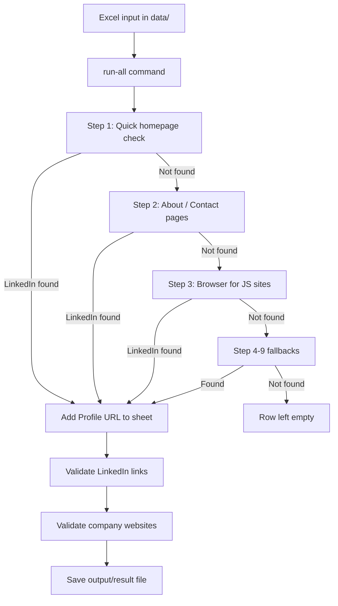

# How the GTM LinkedIn Scraper Works

A short, non-technical guide for reviewers and new team members.

---

## What this tool does

1. Reads a list of companies from an **Excel file** (`data/` folder).
2. Visits each company’s **Official Website** and tries to find their **LinkedIn page**.
3. Checks that the websites and LinkedIn links look valid.
4. Saves everything to a **new Excel file** in `output/` (your original file is not changed).

**One command does it all (company pipeline):**

```powershell
python -m pipenv run python main.py run-all --input "data\Sample file.xlsx" --output "output\result_final.xlsx" --steps 1,2,3 --force --enable-fallbacks
```

**Decision-maker discovery command (Phase 2):**

```powershell
python -m pipenv run python main.py discover-people --input "output\result_final.xlsx" --people-output "output\decision_makers.xlsx" --enable-people-discovery
```

---

## Flow diagram



**Simple view:** Try the fast ways first. Only open a real browser (Step 3) if the fast ways did not find LinkedIn.

---

## The scrape steps (in plain English)

| Step | What it does | Speed |
|------|----------------|-------|
| **Step 1** | Opens the company homepage and looks for a LinkedIn link in the normal page. | Fast |
| **Step 2** | If Step 1 fails: looks harder on the homepage, then checks pages like About Us and Contact. | Medium |
| **Step 3** | If Step 2 fails: opens the site in a hidden Chrome browser so JavaScript (icons, footers) can load, then looks again. | Slowest core step |
| **Step 4** | Searches Bing for the best LinkedIn company URL. | Fast fallback |
| **Step 5** | Uses Brave Search API (if key configured). | Fast fallback |
| **Step 6** | Uses DuckDuckGo as backup search. | Fast fallback |
| **Step 7** | Tries extra same-site pages like team/people/leadership. | Medium fallback |
| **Step 8** | Uses Tavily API (if key configured). | Medium fallback |
| **Step 9** | Uses Apollo API as last resort (if key configured). | Last resort |

- The tool **stops as soon as it finds** a LinkedIn URL.
- If all enabled steps fail, that row stays without a Profile URL.

**When to use fallbacks:** add `--enable-fallbacks` to run Steps 4-9 only for unresolved rows after Step 3.

---

## What we use (technology stack)

| Approach | Faster for this project? | More accurate? | Good fit for Excel row-by-row? |
|----------|--------------------------|----------------|-------------------------------|
| **Our stack: httpx + BeautifulSoup + Playwright + optional fallbacks (Step 4-9)** | Already good | **Yes** — browser + search fallback handles hard cases | **Yes** |
| httpx + Parsel | Slightly, on parsing only | Same as BS4 for finding links | Optional tweak, not needed |
| Scrapy | For huge crawls, not small Excel jobs | Same static pages | Overkill here |
| Requests + BeautifulSoup | Similar to what we have | Same | Lateral move, not better |

**Accuracy** = finding the LinkedIn link on the company website:

- **Normal HTML pages** → Steps 1–2 are enough.
- **JavaScript-heavy pages** (footer icons, etc.) → Step 3 (Playwright) is needed — we already support this.

We do **not** use Scrapy or Parsel in this project.

---

## After scraping: validation

| Phase | What it checks |
|-------|----------------|
| **Validate LinkedIn** | Is the Profile URL formatted correctly? Does the link respond online? |
| **Validate websites** | Does the Official Website load? What is the final URL after redirects? |

`run-all` runs scrape + both validations and saves **one** output file.

---

## Phase 2: Decision-maker discovery

After company discovery is done, the `discover-people` flow finds likely decision makers:

1. Classify company type
2. Expand target role titles
3. Scrape team/leadership pages
4. Search `linkedin.com/in` profiles (Bing/DDG + optional API sources)
5. Score and rank candidates
6. Save to `output/decision_makers.xlsx` (sheet: `Decision Makers`)

---

## Excel columns (output file)

| Column | Meaning |
|--------|---------|
| Official Website | Company website (from your input) |
| Profile URL | LinkedIn link we found |
| Scrape Method | Which step found it (`step1`..`step9_apollo`) |
| URL Valid (syntax) | LinkedIn URL format OK? (`yes` / `no`) |
| URL Status (live) | LinkedIn link reachable? (`OK`, `blocked`, etc.) |
| Website Status | Company website reachable? |
| Website Final URL | Website URL after redirects |

---

## Project folder structure

```
GTM-master/
├── main.py                    # Start here — run commands
├── docs/
│   └── HOW_IT_WORKS.md        # This file
├── gtm/linkedin_scraper/
│   ├── cli.py                 # Commands: scrape, validate-*, run-all
│   ├── io_utils.py            # Read/write Excel
│   ├── scrape.py              # Runs Steps 1–3 per row
│   ├── scrapers/              # Step 1, 2, 3 logic
│   │   ├── step1_html_parse.py
│   │   ├── step2_deep_links.py
│   │   └── step3_playwright.py
│   ├── fallbacks/             # Step 4..9 fallback logic
│   ├── people_discovery/      # Decision-maker profile discovery
│   └── validators/
│       ├── linkedin_urls.py
│       └── official_websites.py
├── data/                      # Put input Excel files here
├── output/                    # Results saved here
└── scripts/                   # Old-style wrappers (optional)
```

---

## Tips

- Close Excel before running, or the save may fail.
- Use `--steps 1,2` for a quicker run; use `1,2,3 --enable-fallbacks` for best coverage.
- Input files live in `data/`; results go to `output/`.

For setup and full commands, see the main [README](../README.md).
